# clauth 架构分析：以 Claude 相关数据获取逻辑为核心

> 本文档由代码分析生成，基于 2026-08-27 时点的代码库（`mommy` 分支）。旨在梳理 clauth 项目的整体架构，并重点解析它如何获取、解析、缓存和写回与 Claude Code / Anthropic 相关的各类数据。

## 1. 项目定位

clauth 是一个用 Rust 编写的 **Claude Code 多账户管理与用量监控工具**，提供 CLI、TUI（`ratatui`）、headless 守护进程（`clauth daemon`）、以及一个通过 MCP 暴露给正在运行的 Claude Code 会话的插件（`clauth mcp`）四种使用形态，共享同一套核心状态与业务逻辑。

核心能力：
- 在多个 Claude Code 账户（OAuth Pro/Max/Team/Enterprise 或自定义 API endpoint）之间一键切换；
- 监控每个账户的 5h / 7d 用量限额，展示 token 消耗与等价 API 成本；
- 达到限额阈值时按预设链路自动切换（fallback chain）；
- 浏览、恢复过往 Claude Code 会话；
- 通过 MCP 让正在运行的 Claude Code 会话查询账户、切换账户、把 prompt 委派给另一个账户执行（`delegate`）。

技术栈：`ratatui`（TUI）、`clap`（CLI）、`rmcp`（MCP server）、`ureq`（同步 HTTP）、`serde_json`、`notify`（文件系统事件）、`tokio`（仅用于 MCP stdio 服务与测试，其余全部同步）、`agentgear`（Claude Code 插件生命周期管理）。

## 2. 顶层模块地图

| 模块 | 职责 |
|---|---|
| `main.rs` / `cli.rs` | clap 命令行骨架、`dispatch()` 唯一分发点 |
| `actions.rs` | 所有对 `AppConfig` / `~/.claude` 状态的**变更**操作，CLI 与 TUI 共用 |
| `claude.rs` | Claude Code 官方文件路径、凭证/设置文件的读写与 symlink 切换 |
| `claude_json.rs` | `~/.claude.json`（全局账户缓存）的读写与身份剥离 |
| `profile.rs` | clauth 自身 `AppState` / `ProfileConfig` 数据结构、原子写、profile 存取 |
| `profile_cache.rs` | `~/.clauth/profiles/<name>/` 下各类缓存文件的统一 IO 层 |
| `profile_json.rs` | profile 相关 JSON 结构定义 |
| `keychain.rs` | macOS Keychain 镜像（Claude Code 在 macOS 上的真实凭证源） |
| `oauth.rs` / `oauth_login.rs` | Anthropic OAuth 登录与刷新（PKCE） |
| `alibaba_login.rs` | 阿里云百炼控制台会话登录（第三方 provider 之一） |
| `jsonsync.rs` / `settings_sync.rs` | 隔离运行时目录与主 `~/.claude` 之间的字段级同步引擎 |
| `sessions.rs` / `sessions_cli.rs` / `logline.rs` | Claude Code 本地会话（JSONL）索引、预览、脱敏、恢复 |
| `live_sessions.rs` | 正在运行的 Claude Code 会话登记与存活探测 |
| `usage/` | 5h/7d 用量数据获取（Anthropic 官方 API）、燃烧速率、多账户轮询调度 |
| `tokens.rs` / `token_ledger.rs` | 本地 token 消耗统计与持久化补丁层 |
| `pricing.rs` | 模型价格表拉取与成本换算 |
| `poll.rs` | 通用轮询骨架，被多个模块复用 |
| `status.rs` | Claude 官方状态事件（incident）feed |
| `throughput.rs` | `delegate` 调用的实测吞吐量采样 |
| `daemon/` | headless 刷新 + 自动切换循环，发布 `status.json` |
| `mcp/` | `rmcp` 实现的 MCP server，四个工具：`profiles`/`switch_profile`/`delegate`/`monitor` |
| `providers/` | 第三方 API 账户（DeepSeek/Zai/Alibaba/OpenRouter/通用）用量探测抽象 |
| `fallback.rs` | 自动切换链的纯决策逻辑 |
| `watchdog.rs` | 用 `notify` 监听凭证/配置文件变化，触发对账 |
| `update.rs` | 自更新（GitHub Releases + SHA-256 + minisign 签名校验） |
| `plugin_host.rs` / `plugin_probe.rs` | `agentgear` 驱动的 Claude Code 插件安装/自愈 |
| `tui/` | `ratatui` 界面，`app.rs` 状态机 + `render/` 纯渲染层 |

## 3. 整体运行时架构

```mermaid
flowchart TB
    subgraph 前端
        CLI[clauth 命令行]
        TUI[clauth TUI]
        Daemon[clauth daemon]
        MCPSrv[clauth mcp 服务器]
    end

    subgraph 共享核心
        Actions[actions.rs 状态变更层]
        Usage[usage/ 用量抓取+调度]
        Tokens[tokens.rs / token_ledger.rs]
        Sessions[sessions.rs / live_sessions.rs]
        Fallback[fallback.rs 自动切换决策]
        Watchdog[watchdog.rs 文件监听对账]
    end

    subgraph 本地存储
        ClauthHome["~/.clauth/ (profiles.toml, profiles/*, caches, locks)"]
    end

    subgraph Claude Code 官方数据
        CredFile["~/.claude/.credentials.json"]
        SettingsFile["~/.claude/settings.json"]
        HomeJson["~/.claude.json"]
        ProjectsDir["~/.claude/projects/*.jsonl (会话)"]
        StatsCache["~/.claude/stats-cache.json"]
        Keychain["macOS Keychain (Claude Code-credentials)"]
    end

    subgraph 外部服务
        OAuthAPI["platform.claude.com OAuth token 端点"]
        UsageAPI["api.anthropic.com/api/oauth/usage,/profile"]
        StatusAPI["status.claude.com/api/v2/incidents.json"]
        PriceFeed["GitHub genai-prices 价格表"]
        GHReleases["GitHub Releases (自更新)"]
    end

    CLI --> Actions
    TUI --> Actions
    Daemon --> Usage
    Daemon --> Fallback
    MCPSrv --> Actions
    MCPSrv -->|fork 子进程| ClaudeProc[claude CLI 子进程]

    Actions --> ClauthHome
    Actions -->|symlink/复制切换| CredFile
    Actions -->|patch env 块| SettingsFile
    Actions -->|macOS| Keychain

    Usage -->|OAuth Bearer| UsageAPI
    Usage --> ClauthHome
    Tokens --> StatsCache
    Tokens --> ProjectsDir
    Tokens --> ClauthHome
    Sessions --> ProjectsDir
    status.rs -.-> StatusAPI
    pricing.rs -.-> PriceFeed
    update.rs -.-> GHReleases

    Watchdog -->|监听| CredFile
    Watchdog -->|监听| SettingsFile
    Watchdog -->|监听| HomeJson
    Watchdog --> Actions
```



## 4. Claude 相关数据获取逻辑详解（核心）

clauth 涉及的"Claude 数据"可以分为四条相互独立的数据线：**账户凭证**（决定"我是谁"）、**会话记录**（决定"聊了什么"）、**用量限额**（决定"还能用多少"）、**服务状态**（决定"Anthropic 那边是否正常"）。四条线的数据来源完全不同，下面逐一说明。

### 4.1 账户凭证数据 —— 本地文件 + macOS Keychain

Claude Code 官方把登录态存在两处：

- **`~/.claude/.credentials.json`**：OAuth token。clauth 用 `claude::claude_credentials_path()`（`claude.rs`）定位，解析为 `ClaudeCredentials { claude_ai_oauth: Option<OAuthToken> }`，`OAuthToken` 含 `access_token`/`refresh_token`/`expires_at`/`scopes`/`subscription_type`（camelCase）。
- **`~/.claude/settings.json`**：clauth 只 patch 其中的 `env` 块（`ANTHROPIC_BASE_URL`/`ANTHROPIC_AUTH_TOKEN` 等）与顶层 `model`/`apiKeyHelper` 字段（`build_claude_settings_json`）。API Key **不落盘**到 settings.json，而是通过 `apiKeyHelper` 指向 `clauth __api-key <profile>` 子命令，Claude Code 需要时现算现出。
- **macOS 上的真实凭证源其实是系统 Keychain**（条目名 `Claude Code-credentials`），因此 `keychain.rs` 在切换账户时把凭证**镜像**进 Keychain——文件 symlink 只是配合非 macOS 平台或历史行为的表面机制，不是存储后端本身。

clauth 自己**不发明**新的凭证存储后端：所有 profile 的凭证仍以明文 JSON 文件形式落盘在 `~/.clauth/profiles/<name>/credentials.json`（0600 权限），只是多了原子写、跨进程锁和两阶段提交（见 4.3）。

`~/.claude.json` 是 Claude Code 的全局账户/项目缓存，`claude_json.rs` 负责在切换账户时执行 `strip_home_oauth_account`：删除其中缓存的 `oauthAccount` 身份块，让 Claude Code 下次启动时自愈、重新派生正确的账户身份，避免"切了账户但界面还显示旧身份"的错位。

### 4.2 OAuth 登录与刷新

- `oauth_login.rs`：标准 PKCE + RFC 8252 本地回环登录。授权端点 `https://claude.com/cai/oauth/authorize`，本地起 TCP 监听接收浏览器回调 code。
- `oauth.rs`：token 端点 `https://platform.claude.com/v1/oauth/token`（固定 `CLIENT_ID`）。`exchange_code` 用授权码换取初始 token；`refresh_result` 用 refresh_token 刷新，请求头刻意模拟 Claude Code 自身的 axios 客户端。`refresh_rejection_is_terminal` 区分"永久失效"（把 profile 打上 `auth_broken` 标记并隔离）与"临时错误"（下次重试）。
- 刷新成功后的落盘走 `apply_rotated_tokens_locked`：先写 `credentials.json.pending` 侧车文件，成功后再覆盖正式的 `credentials.json` 并清除 pending——防止进程在刷新过程中崩溃导致一次性的 `refresh_token` 丢失（OAuth refresh token 通常是一次性的，丢失即需要重新登录）。

`alibaba_login.rs` 是另一条独立的登录路径，服务阿里云百炼（Model Studio）账户：不是 OAuth，而是打开控制台登录页 `bailian.console.aliyun.com`，本地回环等待浏览器 POST 回调拿到一个 48 小时有效、无刷新机制的控制台 session token，专门用来查询 Token Plan 配额（API Key 本身查不到配额）。

### 4.3 clauth 自身的本地存储结构（`~/.clauth/`）

```
~/.clauth/
├── profiles.toml              # AppState：active_profile、profile 列表、fallback_chain 等全局配置
├── clauthd.lock                # daemon 单例锁 + 存在信标
├── clauthd-standby.lock        # --standby 模式的等待槽
├── usage-fetch.lock            # 单一抓取者租约（防多实例重复抓取）
├── token_ledger.json           # 历史 token 消耗的持久化补丁层
├── genai_price_cache.json      # 模型价格表缓存（24h TTL）
├── status_cache.json           # Claude 状态 feed 缓存
├── live_sessions/<sid>.json    # 正在运行的 Claude Code 会话登记
└── profiles/<name>/
    ├── config.toml             # ProfileConfig：base_url/api_key/env/模型路由/阈值
    ├── credentials.json        # OAuth 主凭证快照（0600）
    ├── credentials.json.pending# 刷新中的两阶段提交侧车
    ├── session-token.json      # 长效 setup-token / rolling token 侧车
    ├── usage_cache.json        # 该账户最近一次 5h/7d 用量抓取结果
    ├── third_party_cache.json  # 第三方 provider 用量缓存
    ├── account_id.json / profile_fetched.json / kick_block.json / mcp-logins.json / touch-receipt.json
    ├── quarantine/             # 异常凭证隔离备份
    └── runtime-<sid>/          # clauth start 的每会话隔离运行时目录
```

所有磁盘写入统一走 `atomic_write` / `atomic_write_600`（`profile.rs`）：先写同目录临时文件（`.file.tmp.<pid>.<seq>`），再 `rename` 落地，保证不会读到半写状态；权限固定为文件 0600、目录 0700。

### 4.4 切换（switch）流程与并发安全

调用链：`actions::switch_profile` → `lock::with_state_lock`（跨进程 flock，带超时与可重入）→ `snapshot_active_credentials`（把当前活动账户实时的 `.credentials.json` 写回其 profile 存储，避免丢失 Claude Code 期间自行刷新过的 token）→ `force_link_profile_credentials` / `link_profile_credentials`：删除旧 symlink，指向新 profile 的凭证文件（Unix 用真 symlink，Windows 退化为文件复制）→ macOS 上再镜像进系统 Keychain。

并发安全要点：
- **跨进程状态锁**：所有 profile / 凭证 / settings 的写操作都在 `with_state_lock` 内执行；
- **两阶段提交**：`credentials.json.pending` 侧车，`load_profile` 时自动检测并恢复未提交的刷新，防止崩溃丢数据；
- **单一抓取者租约**：`usage-fetch.lock` 保证同一时刻只有一个 clauth 实例（TUI 或 daemon）真正对外发起用量抓取和自动切换决策，其余实例只从磁盘缓存 hydrate；
- **偏离检测**：若发现 Claude Code 在运行期间自己重写了 `.credentials.json`（不再是 clauth 的 symlink），会判定为 `LinkState::Diverged`，交由用户选择确认 / 丢弃 / 另存为新 profile。

### 4.5 会话数据获取（本地 JSONL）

Claude Code 把每次会话写在 `~/.claude/projects/<slug>/<sessionId>.jsonl`（隔离运行时会话则在各自 `runtime-<sid>/projects/` 下）。

- `sessions.rs::build_index()` 递归扫描全局 `projects/` 目录 + 所有存活隔离运行时的会话目录（深度上限 8 层）；会话 id 取**文件名**而非文件内 `sessionId` 字段（后者在 resume 时会被继承、不可靠）。
- 出于性能考虑采用**头尾读取**而非全文件解析：`read_head()` 只读文件头 256KB 拿 `cwd` 与首条用户消息；`read_last_user_message()` 从文件尾部倒着扫（64KB 分块，最多 1MB）取最后一条用户消息。作者注释中提到全量解析 12k 个会话、5.4GB 的库要 11.3 秒，改成头尾读取后仅需 44 毫秒。
- 预览文本经三层正则脱敏（API key / JWT / Bearer / 键值对 / 高熵字符串），避免把密钥泄露到 TUI 界面或日志。
- 只有在需要精确 token/成本统计时才会调用更重的 `tokens::file_hourly_model_tokens()` 做全文件解析，是可选的第三层开销。
- 隔离运行时目录被 GC 前，其 `projects/` 及配套目录（`shell-snapshots`/`todos`/`paste-cache` 等）会被原子性"救回"合并进全局会话库，避免历史会话随隔离目录清理而丢失。

**"某账户当前是否有会话在跑"** 不是靠猜测文件 mtime，而是显式登记制：`clauth start` 启动时向 `~/.clauth/live_sessions/<sid>.json` 写入 `LiveSession` 记录（pid、账户、cwd 等），真正的存活判定依赖该记录对应的 flock 是否仍被持有；此外还单独统计未经 `clauth start` 启动的"裸跑" `claude` 进程。

### 4.6 用量数据获取（5h / 7d 限额）—— 官方 API

这是与会话数据完全独立的数据源：**5h/7d 用量数字全部来自 Anthropic 官方 API，不是从本地会话记录推算出来的**。

- `usage/fetch.rs` 请求 `https://api.anthropic.com/api/oauth/usage` 与 `https://api.anthropic.com/api/oauth/profile`；
- 鉴权走 `Authorization: Bearer <access_token>`（OAuth token，而非 API key）；
- `/usage` 请求额外带 `anthropic-beta: oauth-2025-04-20` 头，并伪装成 Claude Code 官方 CLI 的 `User-Agent`（代码注释明确说明这是为了不被更严格的第三方客户端限流规则命中）；
- 响应体 `limits[]` 数组被解析为 `session`（5h 窗口）、`weekly_all`（7d 总窗口）、`weekly_scoped`（按模型的周窗口）；
- `/profile` 每小时最多拉一次，用于获取账户的 plan tier；
- 限流保护：同一 host 的请求排队间隔 5 秒，收到 429 时读取 `retry-after` 响应头并做退避。

调度层 `usage/scheduler.rs` 用 1 秒心跳 tick 检查每个 profile 是否到期需要 refetch（默认周期 90 秒，可配置）；`usage/burn.rs` 则是纯本地计算，基于历史抓取样本推算燃烧速率与到限额的预计时间，不发起任何网络请求。

### 4.7 Token 统计与成本换算 —— 本地推算 + 远程价格表

与 4.6 的官方限额数字不同，token 消耗统计走另一条纯本地路径：

- `tokens.rs` 先秒读 `~/.claude/stats-cache.json`（Claude Code 自己维护的预聚合快照）作为基线，再扫描 `~/.claude/projects/` 中比该快照更新的 JSONL 增量部分逐行统计，按消息 id 去重、合并流式增量，90 秒刷新一次；
- `token_ledger.rs` 把已经"过去"的每日数据持久化到 `~/.clauth/token_ledger.json`，防止 Claude Code 自身按 `cleanupPeriodDays` 裁剪旧会话记录后历史统计跟着丢失，用单调水位线保证每天只落盘一次；
- `pricing.rs` 的模型价格表**不是硬编码**，而是每 24 小时从 `github.com/pydantic/genai-prices` 的公开数据源拉取并缓存，只保留一方（非转售商）价格，按小时级 token 分桶乘以当时生效费率求和，得到"API 等价成本"。

### 4.8 Claude 官方状态 feed

`status.rs` 请求 `https://status.claude.com/api/v2/incidents.json`（Statuspage 标准 v2 接口，无需鉴权），5 分钟轮询一次，响应体上限 2MB，缓存到 `~/.clauth/status_cache.json`，用于 TUI 的 Status 标签页展示事件流。这与 Anthropic 用量 API 完全无关，是独立的第三方状态页数据源。

### 4.9 观测吞吐量（非官方数据）

`throughput.rs` 不是被动监测，而是 clauth 自己在通过 MCP `delegate` 工具发起 headless 调用时的**主动采样**：每次成功调用记录 `output_tokens` 与耗时算出 tok/s，滚动保留每模型最近 24 条样本；取最近 5 条的加权平均与历史最佳值比较，低于 50% 且样本数≥3 时标记为"降速"。因为 clauth 本身不在真实推理请求路径上，这是它唯一能观测到的吞吐量信号，与 5h/7d 限额是两套独立指标。

### 4.10 通用轮询骨架

`poll.rs::run_polling_loop()` 是被 `status.rs`/`pricing.rs`/`tokens.rs` 复用的通用轮询函数：阻塞等待手动刷新信号或超时，重启后会根据缓存时间戳计算首次还需等待多久，避免进程重启后立刻打一轮请求。各模块自定周期：pricing 24 小时、status 5 分钟、tokens 90 秒、usage 抓取周期取自用户配置（默认 90 秒）。

## 5. 数据来源全景表

| 数据类型 | 来源 | 具体位置/接口 | 更新方式 |
|---|---|---|---|
| OAuth 凭证 | Claude Code 本地文件 + macOS Keychain | `~/.claude/.credentials.json`、Keychain 条目 `Claude Code-credentials` | 切换时读写；到期时通过官方 OAuth 端点刷新 |
| API Key / base URL | Claude Code 本地文件 | `~/.claude/settings.json` 的 `env` 块 / `apiKeyHelper` | 切换时 patch |
| 账户身份缓存 | Claude Code 本地文件 | `~/.claude.json` | 切换时清除 `oauthAccount` 字段 |
| 会话记录 | Claude Code 本地文件 | `~/.claude/projects/**/*.jsonl` | 头尾读取索引；按需全量解析 |
| 5h/7d 用量限额 | Anthropic 官方 API | `api.anthropic.com/api/oauth/usage`、`/profile` | OAuth Bearer 鉴权，默认 90 秒轮询 |
| Token 消耗统计 | Claude Code 本地文件 | `~/.claude/stats-cache.json` + 增量扫描 JSONL | 90 秒刷新，本地持久化补丁 |
| 模型价格表 | 第三方公开数据源 | GitHub `pydantic/genai-prices` | 24 小时刷新 |
| Claude 服务状态 | Statuspage 公开 API | `status.claude.com/api/v2/incidents.json` | 5 分钟轮询 |
| 实测吞吐量 | clauth 自身采样 | MCP `delegate` 调用耗时/token 统计 | 每次 delegate 调用后 |
| 自身版本更新 | GitHub Releases | Releases API + SHA-256 + minisign 签名 | 后台线程按需检查 |

## 6. 后台调度：daemon 与前端如何共享状态

`daemon/` 提供 headless 循环，主循环 1 秒一次 tick，只负责执行队列中的切换动作并重写 `status.json`；实际的用量抓取与自动切换决策由 `usage` 模块内的调度器（同样 1 秒心跳）驱动，TUI 与 daemon 共用同一套 `spawn_refresher`/`build_status` 函数，保证输出口径一致。

跨进程协调靠 `~/.clauth/` 下的三把 flock：
- `clauthd.lock`：daemon 单例信标；
- `clauthd-standby.lock`：`--standby` 模式的单等待槽，防止孤儿进程堆积；
- `usage-fetch.lock`：单一抓取者租约，确保同一时刻只有一个实例（TUI 或 daemon）真正对外发起用量抓取，其余实例只读缓存。

`status.json` 由 `Daemon::write_status` 原子写出（schema version=1），供外部菜单栏 App 等第三方消费者读取账户状态、用量窗口、fallback 状态等。

## 7. MCP 插件：把账户数据暴露给运行中的 Claude Code 会话

`mcp/mod.rs` 用 `rmcp` 的 `#[tool_router]`/`#[tool]` 宏实现 stdio MCP server，四个工具：

- `profiles`：列出所有账户及其缓存用量（零网络开销，纯读磁盘缓存）；
- `switch_profile`：重新链接全局 `~/.claude` 凭证到另一账户；
- `delegate`：**真正 fork 出一个 `claude` 子进程**，用目标账户的独立运行时目录（`CLAUDE_CONFIG_DIR`）跑一个 headless prompt（`-p ... --output-format stream-json --verbose`），支持阻塞/后台两种模式、多账户 fan-out、会话 resume，并通过环境变量限制递归委派深度为 1 层；
- `monitor`：查询/等待后台 `delegate` job 的结果（磁盘持久化在 `~/.clauth/jobs/`），或等待 clauth 自身状态变化（活跃账户、用量缓存、凭证文件）。

这一层是 clauth 架构中"数据获取"与"数据消费"角色反转的地方：正在运行的 Claude Code 会话反过来通过 MCP 向 clauth 查询它自己的账户/用量数据。

## 8. 架构设计要点小结

1. **四条数据线彼此解耦**：凭证（本地文件+Keychain）、会话（本地 JSONL）、用量限额（官方 API）、服务状态（Statuspage）来源完全不同，互不依赖，任一数据源不可用不影响其余三条。
2. **本地缓存优先，网络请求退化为增量刷新**：TUI 展示的用量条形图始终来自磁盘缓存，即使 Anthropic API 限流或离线也能显示上一次抓取的结果。
3. **性能上偏好"读少量字节代替全量解析"**：会话索引的头尾读取策略是典型例子，把秒级操作压到毫秒级。
4. **写入路径统一走原子写 + 跨进程锁 + 两阶段提交**：凭证刷新、profile 切换、status.json 发布均遵循同一套模式，避免多实例（TUI + daemon + MCP）并发写坏文件。
5. **伪装官方客户端请求头以规避第三方限流**：用量 API 请求特意模拟 Claude Code 自身的 User-Agent/Beta header，这是与 Anthropic 官方接口交互时的一个值得注意的实现细节。
6. **单一抓取者租约模式**：多个 clauth 前端（TUI/daemon）不会重复对外发起用量抓取，通过文件锁选出"当前负责人"，其余实例只读缓存 hydrate。

---

*注：本文档在生成过程中，用于研究的子代理报告被平台安全过滤器标记为"包含指令形态文本"（因为源代码和分析内容大量涉及 `settings.json` 等真实文件名与结构，触发了启发式误报），已确认为正常的技术分析内容，不包含任何注入指令，特此说明。*
